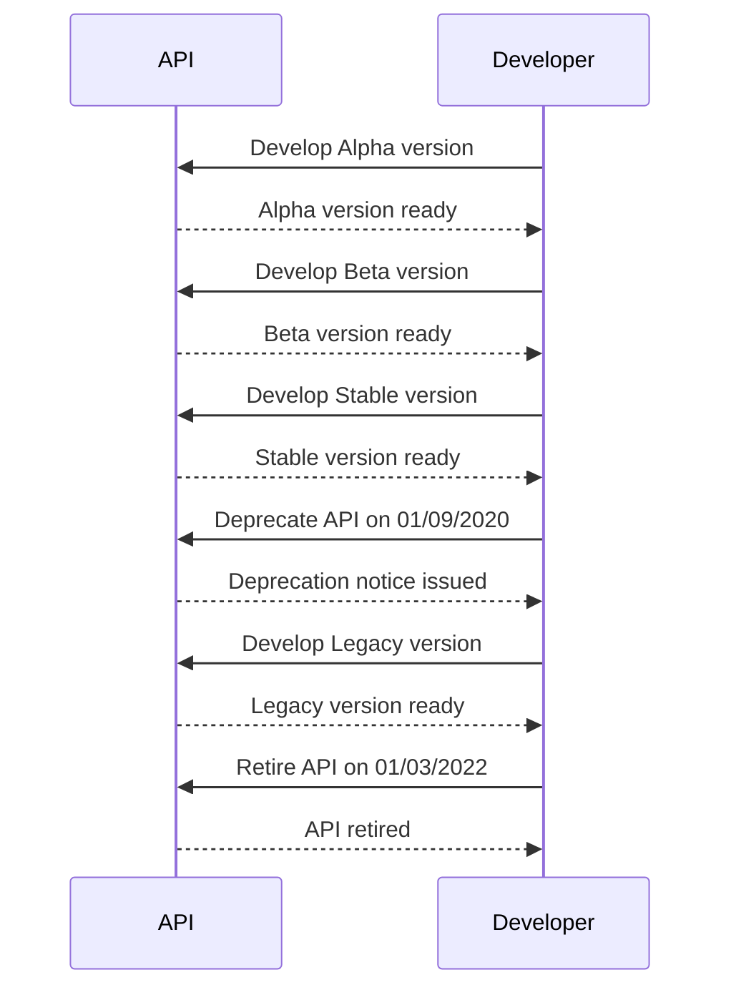

This is the base Jekyll theme. You can find out more info about customizing your Jekyll theme, as well as basic Jekyll usage documentation at [jekyllrb.com](https://jekyllrb.com/)

You can find the source code for Minima at GitHub:
[jekyll][jekyll-organization] /
[minima](https://github.com/jekyll/minima)

You can find the source code for Jekyll at GitHub:
[jekyll][jekyll-organization] /
[jekyll](https://github.com/jekyll/jekyll)

[jekyll-organization]: https://github.com/jekyll
