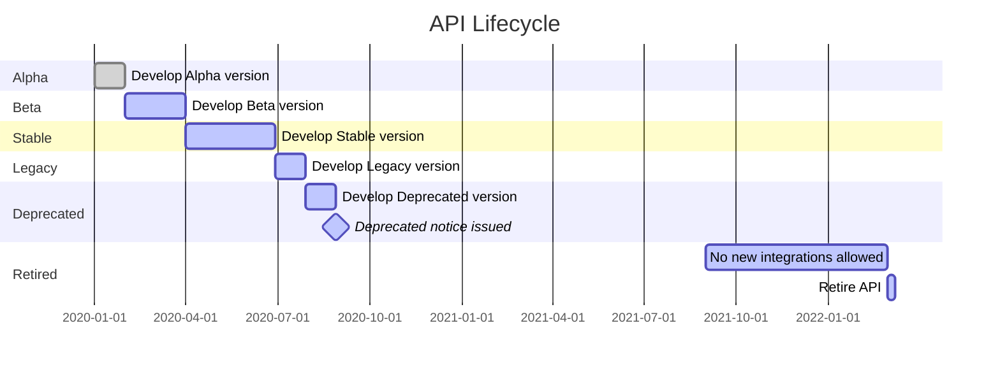

# API Lifecycle Timeline

```mermaid
%%{init: { 'theme': 'default' }}%%
%%{ 'version': '9.1.3' }%%

gantt
    title API Lifecycle
    dateFormat  YYYY-MM-DD

    section Alpha
    Develop Alpha version          :done,    alpha1, 2020-01-01, 7d
    Develop Beta version           :active,  beta1, after alpha1, 14d

    section Stable
    Develop Stable version         :done,    stable1, after beta1, 21d
    Deprecate API                  :active,  deprecated, 2020-09-01, 30d

    section Legacy
    Develop Legacy version         :active,  legacy1, after deprecated, 14d

    section Deprecated
    Deprecated notice issued       :active,  deprecatedNotice, 2021-09-01, 30d

    section Retired
    Retire API                      :active,  retired, 2022-03-01, 7d

```
Yes, This is the base Jekyll theme. You can find out more info about customizing your Jekyll theme, as well as basic Jekyll usage documentation at [jekyllrb.com](https://jekyllrb.com/)

You can find the source code for Minima at GitHub:.
[jekyll][jekyll-organization] /
[minima](https://github.com/jekyll/minima)

You can find the source code for Jekyll at GitHub:
[jekyll][jekyll-organization] /
[jekyll](https://github.com/jekyll/jekyll)


[jekyll-organization]: https://github.com/jekyll

